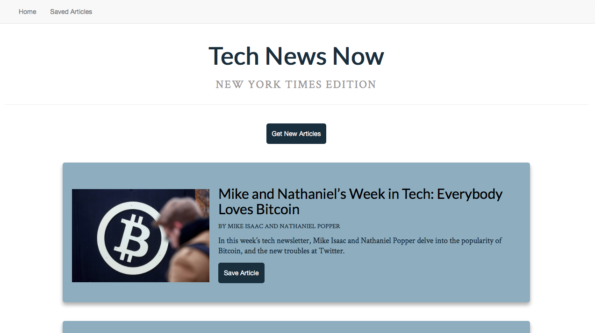

# Tech-News Web Application

## Overview

An app that scrapes articles from the New York Times website (Technology section of course) and lets users save articles and leave comments on the latest news. Data is saved in MongoDB.

## Utilizing the App

* View the app: [Heroku Link](https://tech-news-carvalho.herokuapp.com)

- Scrape articles by clicking the "Get New Articles" button.
- Once articles are loaded, read full article by clicking the link in each article's panel and save articles by clicking the "Save Article" button.
- Saved articles can be viewed at the "Saved Articles" page.
- Comments can be added on saved articles by clicking the "Add a Note" button.
- Saved articles and notes can be deleted by clicking the "Delete" button.

## Illustrations

### Home Page to Retrieve New Articles:

### Saved Articles Page / Add Notes to Articles:

## Tech Used
- Node.js
- Express.js
- Handlebars.js
- MongoDB
- Mongoose
- npm packages
    - body-parser
    - express
    - express-handlebars
    - mongoose
    - cheerio
    - axios

## Built With

* Sublime Text - Text Editor

